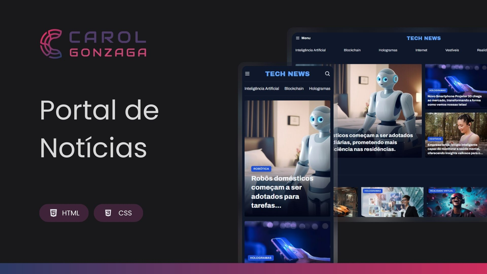

  

 

Projeto de um portal de notícias com foco em conteúdo dinâmico e acessível.

  <a href="#-tecnologias">Tecnologias</a>&nbsp;&nbsp;&nbsp;|&nbsp;&nbsp;&nbsp;<a href="https://carolgonzaga.github.io/portal-de-noticias/">Acesse o Projeto</a>

 
 

  

 
 

## 🚀 Tecnologias

Esse projeto foi desenvolvido com as seguintes tecnologias:

- HTML5  
- CSS3

 
 

## 🎯 Objetivo

O objetivo desse desafio é consolidar conhecimentos sobre layout e posicionamento de elementos usando CSS Grid.
